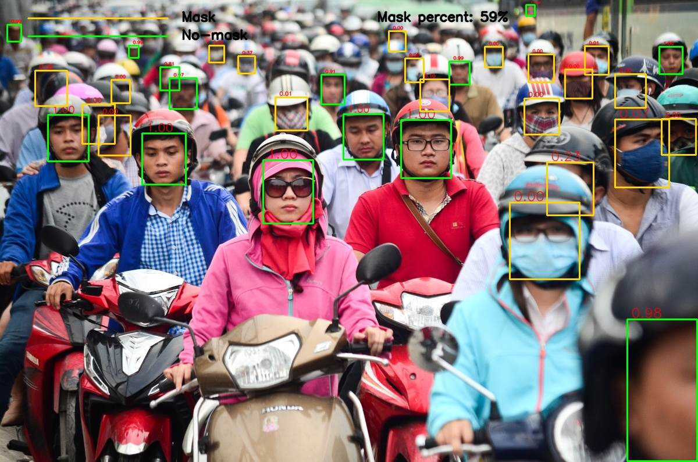
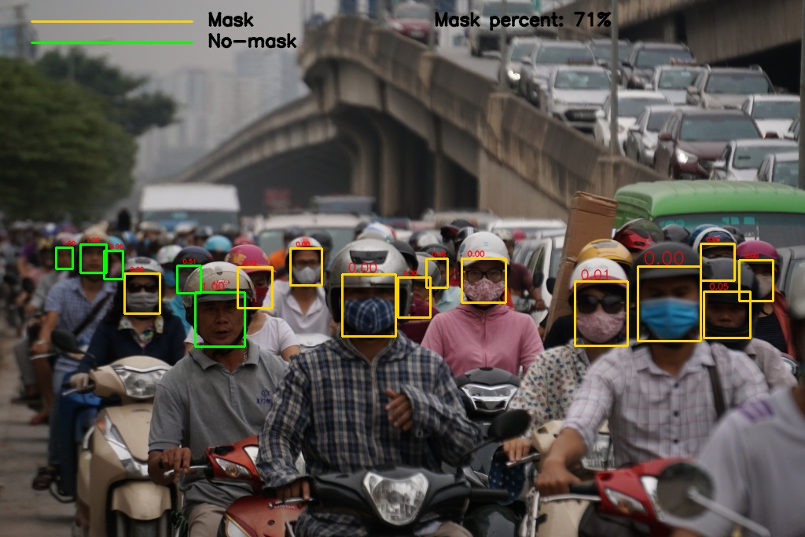
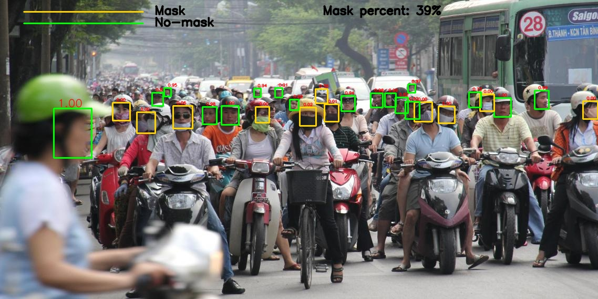
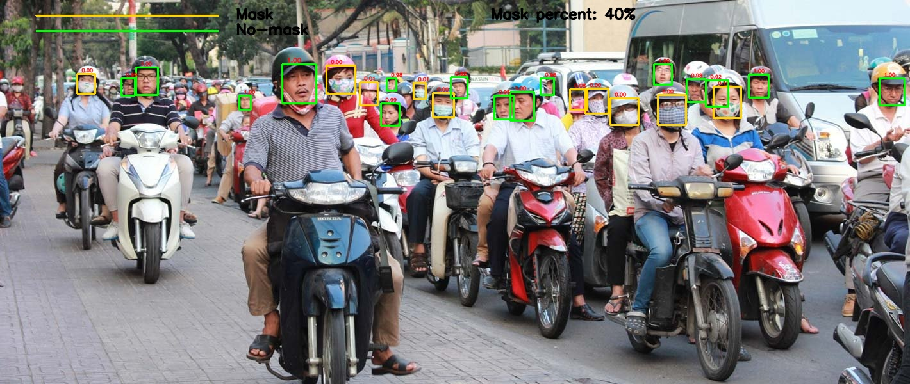

# Mask Classifier

## Introduction

This repository contains codes for training and evaluating mask classifier model.
Please note that our implementation mostly based on python3.

### Some of the results:






## Contents

1. [Installation](#install)
2. [Running the demo](#demo)
3. [Training a model](#train)

<a name="install"></a>
## Installation
1. Clone the repository:
```
git clone https://github.com/aome510/Mask-Classifier.git
```
2. Setup SSH:
* [Install and setup SSH requirements](./lib/SSH/README.md#installation)
* [Install SSH caffemodel](./lib/SSH/README.md#demo)
3. Install python requirements:
```
pip install -r requirements.txt
```

<a name="demo"></a>
## Running the demo
To run the demo, first you need to download the pre-trained mask classifier model from [here](https://drive.google.com/file/d/1Ogew-mbiMqznzO3ok_T-IiqQGpq4OHw5) and then save it into a folder named ```model/```.

After downloading the model, you can run demo on webcam with:
```
python demo.py
```
If you want to demo on videos, you can download our demo videos from [here](https://drive.google.com/drive/folders/1PSw1eDErcjLaOkIUxYXbLEacBNdaMjHQ) and then save it into a folder named ```data/videos/```. After that, you can modify ```demo.py``` file to run demo on videos.

<a name="train"></a>
## Training a model

### Prepare dataset:

1. CelebA dataset:

    You can download CelebA dataset from [here](https://www.kaggle.com/jessicali9530/celeba-dataset) and then save it into a folder named ```data/celebA/```

2. WiderFace dataset:
    
    You can download WiderFace dataset from [here](https://drive.google.com/open?id=16a0TSvPI_3up7tbblxTHxXj5hZ9N7RyH) and then save it into a folder named ```data/WiderFace/```
3. MAFA dataset:
    
    You can download MAFA dataset from [here](https://drive.google.com/drive/folders/1nbtM1n0--iZ3VVbNGhocxbnBGhMau_OG) and then save it into a folder named ```data/MAFA/```
4. Mask Classifier dataset (our dataset):
    
    You can download Mask Classifier dataset from [here](https://drive.google.com/open?id=1WLKCLvR_nXSsOUywqKixoetz03WoJ8cL) and then save it into a folder name ```data/mask_classifier/```

### Combine dataset:
After downloading all the datasets listed above you can run:
```
python gen_data.py
```
to combine datasets and split datasets for training and cross-validating model.

### Train model:

After preparing train and cross-val data, you can train model by:
```
python train.py
```
By default, we use resnet50 network to train. If you want to change network, you can modify ```train.py``` file. Currently, we only support resnet50 and reception_resnet_v2 networks. You can read [this](https://keras.io/applications/) if you want to train with diffrent networks.